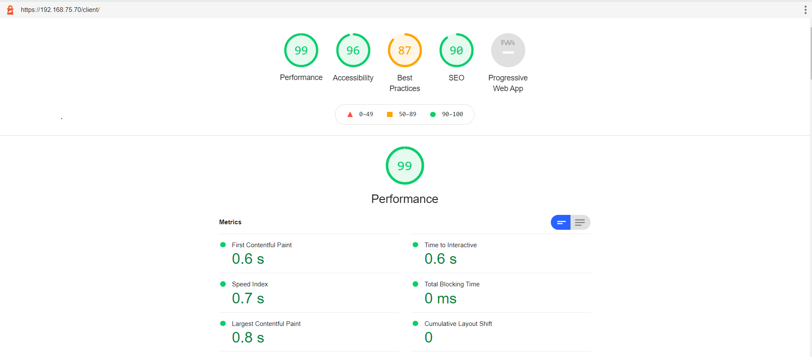

# Mif03_TP
***TP7***

I - Section procédure d'installation correspondant aux optimisations réalisées :

***déploiement sur Tomcat***

Déploiement sur Tomcat : https://192.168.75.70/api/client

***déploiement sur nginx avant Optimisation***

Déploiement sur Nginx : https://192.168.75.70/client
    
***déploiement sur nginx aprés optimisation***
         
Déploiement sur Nginx : https://192.168.75.70/clientPerf

- utilisation d'un wifi (Edurom) depuis l'intérieur de la fac.
- Utilisation les bibliothèques de code avec CDN pour : Jquery,Mustache,popper,boostrap.
- les modifs fait pour l'amélioration : 
    - CDN fait depuis TP5.
    - async/defer pour les scripts.
    - Minification des resources.
    - Refactoring de l'application
- les scriptes sont requéter asynchronement.

II - Section les mesures de performance :

 1. Analyse de l'état initial de l'application

    ***déploiement sur Tomcat*** : https://192.168.75.70/api/client

    
    - le temps de chargement de la page HTML initiale:

        - script: (performance.timing.responseEnd -performance.timeOrigin);
        
        - valeur: 63.62 ms

    - le temps d'affichage de l'app shell:
        
        - script: (performance.getEntries().filter(x => (x.name == "first-paint"))[0].startTime);
        
        - valeur:  305.16 ms 

    - le temps d'affichage du chemin critique de rendu (CRP):

        - script: (performance.timing.domComplete -performance.timeOrigin);

        - valeur: 482.04 ms 
    
2. Déploiement des fichiers statiques sur nginx

    ***déploiement sur nginx***: https://192.168.75.70/client

    
    - le temps de chargement de la page HTML initiale:

        - valeur :  32.10 ms 

        - pourcentage d'amélioration : 49%

    - le temps d'affichage de l'app shell:

        - valeur : 197.4 ms

        - pourcentage d'amélioration : 35%

    - le temps d'affichage du chemin critique de rendu (CRP):

        - valeur : 245,55 ms 

        - pourcentage d'amélioration : 49%  

    

3. Optimisation de votre application

        -rapport d'audit LightHouse de notre SPA avant l'Optimisation:

    

    - Utilisation de CDN:
        
        Nous avons utiliser les CDN pour les differentes  bibliothèques de code dans le TP d'avant (TP5), donc Aucune amélioration dans les valeurs en essayent des liens differentes pour inclure  differentes versions des  bibliothèques utiliser en utilisant la CDN.

- Refactoring de l'application :   

    ***déploiement sur Tomcat*** https://192.168.75.70/api/client

    - le temps de chargement de la page HTML initiale:

        - avant :  63.62 ms

        - apres : 45.23 ms

        - pourcentage d'amélioration : 28%

    - le temps d'affichage de l'app shell:

        - avant : 305.16 ms 

        - apres : 268.63 ms

        - pourcentage d'amélioration : 11%

    - le temps d'affichage du chemin critique de rendu (CRP):

        - avant : 482.04 ms

        - apres : 352.27 ms 

        - pourcentage d'amélioration : 27% 

    ***déploiement sur nginx*** : https://192.168.75.70/clientPerf

    - le temps de chargement de la page HTML initiale:

        - avant :  32.10 ms

        - apres : 23.56 ms

        - pourcentage d'amélioration : 26%

    - le temps d'affichage de l'app shell:

        - avant : 197.4 ms

        - apres : 139.96 ms

        - pourcentage d'amélioration : 35%

    - le temps d'affichage du chemin critique de rendu (CRP):

        - avant : 245,55 ms

        - apres : 192.85 ms

        - pourcentage d'amélioration : 49% 
    
    
- Utilisation d'attributs async et/ou defer :   

    ***déploiement sur Tomcat***: https://192.168.75.70/api/client

    - le temps de chargement de la page HTML initiale:

        - avant :  45.23 ms

        - apres :  33.21 ms

        - pourcentage d'amélioration : 26%

    - le temps d'affichage de l'app shell:

        - avant : 268.63 ms 

        - apres : 185.26 ms

        - pourcentage d'amélioration : 31%

    - le temps d'affichage du chemin critique de rendu (CRP):

        - avant : 352.27 ms

        - apres : 248.06 ms

        - pourcentage d'amélioration : 29% 

    ***déploiement sur nginx***: https://192.168.75.70/clientPerf

    - le temps de chargement de la page HTML initiale:

        - avant :  23.56 ms

        - apres :  19.92 ms

        - pourcentage d'amélioration : 15%

    - le temps d'affichage de l'app shell:

        - avant : 139.96 ms

        - apres : 114.36 ms

        - pourcentage d'amélioration : 18%

    - le temps d'affichage du chemin critique de rendu (CRP):

        - avant : 192.85 ms

        - apres : 155,96 ms

        - pourcentage d'amélioration : 19% 

- Minification réduction du nombre de ressources critiques :
        
    ***déploiement sur Tomcat*** : https://192.168.75.70/api/client
    - le temps de chargement de la page HTML initiale:

        - avant :  33.21 ms

        - apres :  22.35 ms

        - pourcentage d'amélioration : 32%

    - le temps d'affichage de l'app shell:

        - avant : 185.26 ms 

        - apres : 132.48 ms

        - pourcentage d'amélioration : 28%

    - le temps d'affichage du chemin critique de rendu (CRP):

        - avant : 248.06 ms

        - apres : 168.15 ms

        - pourcentage d'amélioration : 32% 

    ***déploiement sur nginx***: https://192.168.75.70/clientPerf

    - le temps de chargement de la page HTML initiale:

        - avant :  19.92 ms

        - apres :  17.1 ms

        - pourcentage d'amélioration : 14%

    - le temps d'affichage de l'app shell:

        - avant : 114.36 ms

        - apres : 82.17 ms

        - pourcentage d'amélioration : 28%

    - le temps d'affichage du chemin critique de rendu (CRP):

        - avant : 155,96 ms

        - apres : 129.35 ms

        - pourcentage d'amélioration : 17% 

